# SoccerMap Enchancement with Deformable Convolution Network Implementation

## SoccerMap

The SoccerMap feature extractor block (Fernandez and Bornn 2020) is a fully convolutional neural network architecture capable of estimating full probability surfaces from spatiotemporal football data. It leverages fully convolutional neural networks and a combination of sampling layers to sample data at different resolutions. This allows for relevant information to be captured at a local and global perspective within the defined state space.

This feature extractor block is a fundamental component to the development of major statistical models used in football analytics such as pass success probability, pass selection probability, EPV, action selection probability, etc. The model parameters learned are specific to each statistic and vary according to the input surfaces definition, and the target outcome definition. However, the SoccerMap neural network architecture itself remains the same across all models.

## Deformable Convolution Networks

Deformable Convolution Networks were proposed to address a longstanding challenge in computer vision; effectively modeling geometric transformations and accounting for geometric variations in images. Naturally, an object can appear in many diverse forms and perspectives, these differences in object scale, viewpoint, and deformations can significantly affect a model’s performance.

Traditional approaches to handling these variations rely on building training datasets with sufficient examples to capture these deformations or using transformation-invariant algorithms. However, these techniques assume that geometric transformations are fixed and known, or rely on hand-crafted invariant features, which often do not generalize well to unseen data.

While traditional CNNs are relatively standard for vision tasks, they are inherently limited in modeling large, unknown transformations due to their fixed geometric structure in input sampling. 

Unlike standard CNN's, where the receptive field is fixed, Deformable Convolution Networks can dynamically adjust the position of each sampling point in response to the input features through learnt offsets, allowing the network to better capture local transformations. These learned transformations are dense, making DCNs particularly powerful for tasks that require precise spatial understanding.

                            

## Proposition

There are notable similarities worth exploring between the challenges that DCN's attempt to address in computer vision, the architecture of SoccerMap, and the limitations inherent in football data collection. We plan to investigate the effectiveness of DCNs on football spatiotemporal data by substituting (some) CNN's with DCNs in the SoccerMap architecture.

Our approach will aim to replicate (within constraints) the experimental procedure for estimating pass success probability as outlined in the original SoccerMap paper.

Some initial ideas on why this may be effective:

- Improvements in modeling geometric demoration and spatial influence.
- More sample efficient, similar to how DCN's improved data limitation issues with CNN training, SoccerMap with DCN may be able to create more accurate probability estimations with less data.
- If it is more sample efficient, we can improve models by creating individual statistical models for specific tactics, teams, or playstyles. The data collection constraints will be less taxing.
- Deformable convolution may better approximate the biological ability to make flexible, context-dependent connections compared to regular convolution. We may be able to create probability distributions that are less 'gradient' and more intuitive, potentially resulting in patterns that are easier to interpret. (Reaching? Maybe...)

## Data

We worked with open-source, anonymous games with tagged events and player tracking data from Friends-of-Tracking-Data. We use a total of 543 passes with a 89% success rate split into a 60/20/20 split for training, testing, and validation, a far-cry from the 433,295 passes with a 79% success rate used in the original experiment. We don't expect to be able to produce an effective model with this dataset, but we will be able to investigate how the DCN SoccerMap processes spatiotemporal data compared to the CNN SoccerMap.

## Game State Representation

Fernandez and Bornn outline a 13 channel game representation processed from each tracking snapshot to be used for the pass probability model. Each channel is a matrix of size (104,68)  representing the field.

- Sparse matrix with the locations of attacking team

- Sparse matrix with x velocity vector of attacking team players

- Sparse matrix with y velocity vector of attacking team players

- Sparse matrix with the locations of defending team

- Sparse matrix with x velocity vector of defending team players

- Sparse matrix with y velocity vector of defending team players

- Dense matrix of distances to ball location

- Dense matrix of distances to goal location

- Dense matrix of sin angles between goal and ball

- Dense matrix of cos angles between goal and ball

- Sparse matrix of sin angles between carrier and teammates velocity vectors

- Sparse matrix of cos angles between carrier and teammates velocity vectors

For this specific problem, each game state representation (pass start position) is paired with the pass ending position, and whether or not the pass was a success. 

## DCN Model Design

The SoccerMap model implementation is sourced from un-xPass, since substituting DCN's for CNN's is relatively seamless, limited changes to the architecture were needed. After experimenting with different design iterations (considering our small dataset), we settled on an updated model that performs a DCN feature extraction at 1/2x resolution, keeping the CNN feature extractions at the 1x and 1/4x resolutions for stability and performance reasons. 

## Channel Processing

 We are aware that some of the representation channels would be better suited for DCN processing over others, and wanted to explore the feasibility of creating a model that only processes specific channels through a DCN feature extraction layer. To investigate this, we ran each relative representation component group through a default SoccerMap model, and a SoccerMap DCN model in the context of a pass probability success model. We visualised each probability output on the same random sample from the testing dataset.

### Positions (att, def)

      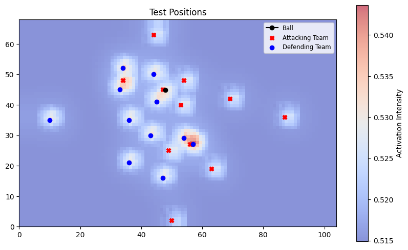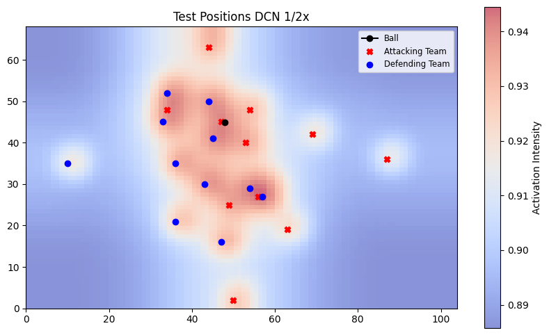

### Velocities (att, def)

    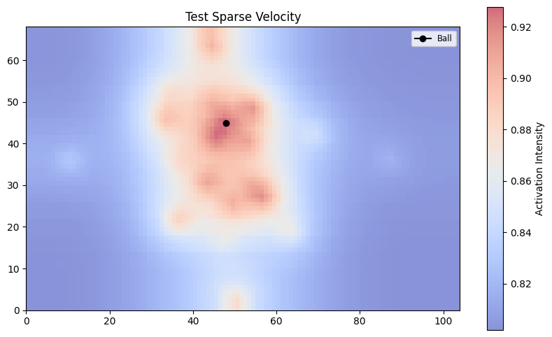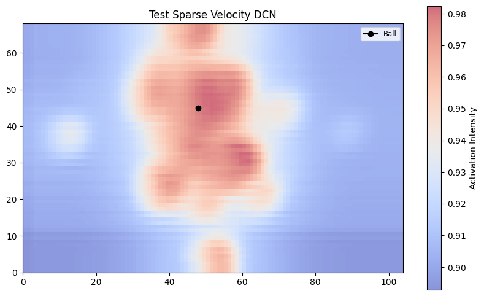

### Distances (goal, ball)

    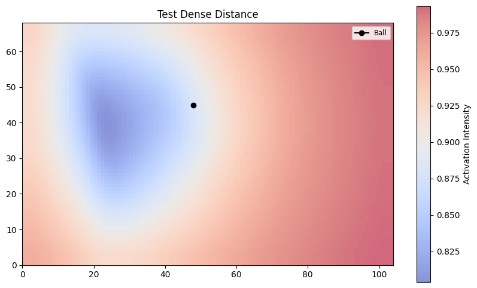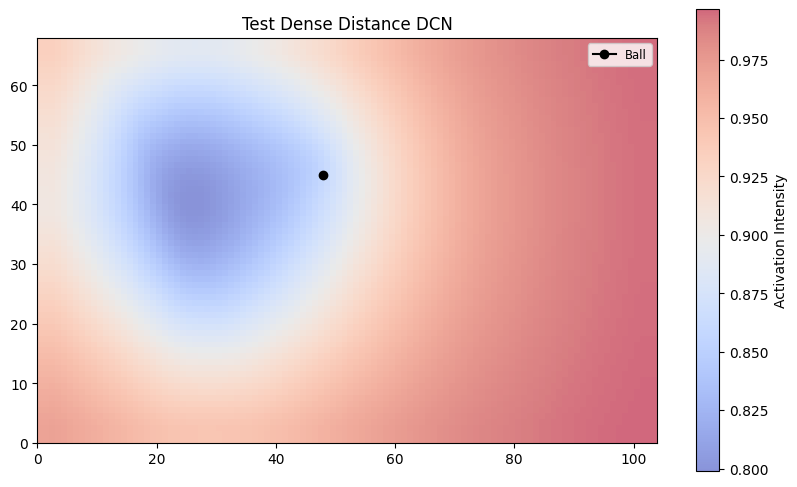

### Angles (goal, ball)

    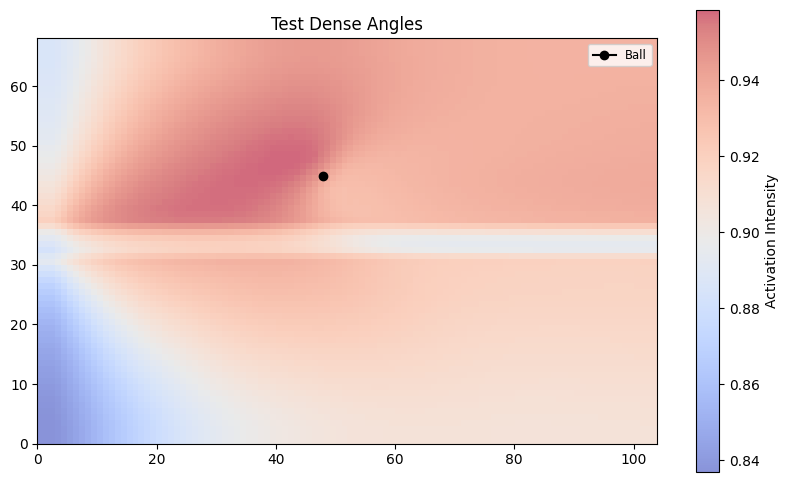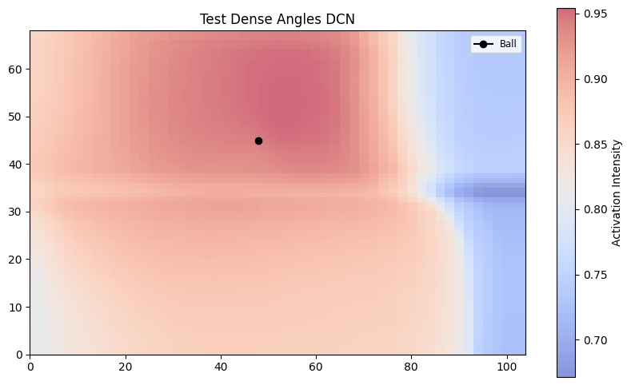

### Angles (carrier vel, team vel)

    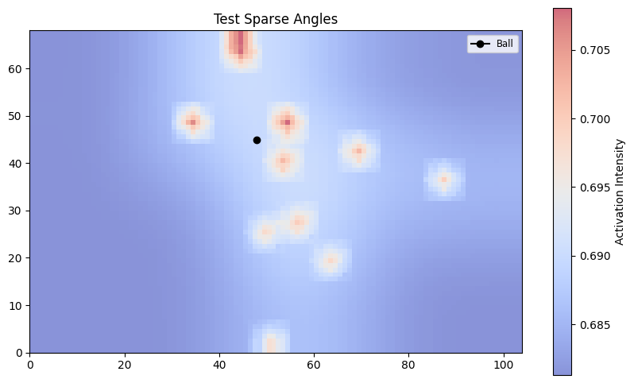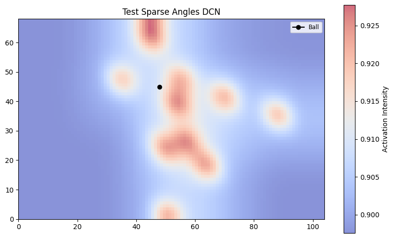

Given these channel specific distributions, we are able to deduce that the channels built off the sparse matrices have the most significant results when processed by the DCN. We say significant as the DCNs appear to preform as intended. This lines up with the theory, as the geometric demormations will be more pronounced in a sparse matrix. To implement this, we modified the model architecture to process the 8 channels derived from the sparse matrices through deformable convolutional layers, while the remaining 5 channels pass through standard convolutional layers. This was achieved by splitting the input tensor based on channel indices and directing each subset through its respective feature extraction pathway. 

## Pass Success Probability Model Initial Comparison

### Default SoccerMap

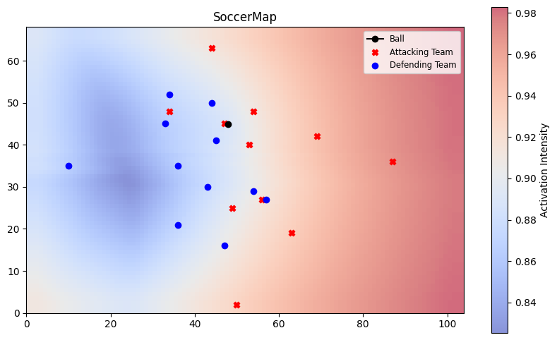

### SoccerMap DCN no Channel Split

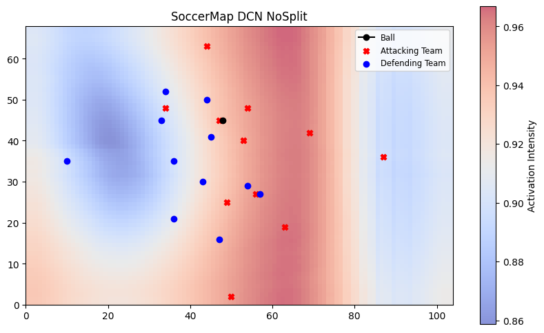

### SoccerMap DCN with Channel Split

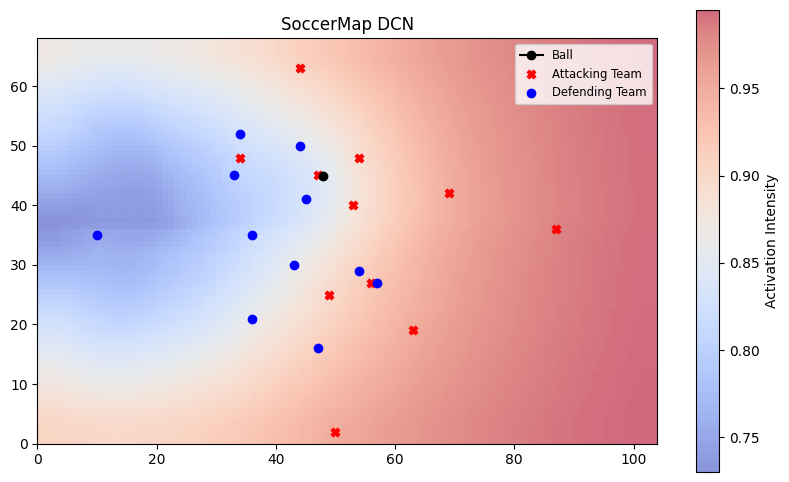

### To continue

- [ ] Properly implement Target-Location loss as described in the original paper, for the complete experimental process

- [ ] Experiment with a proper event and tracking dataset

- [ ] Implement DCN v2 (Modulated Deformable Modules)

## Sources

1. ([[2011.09426] A framework for the fine-grained evaluation of the instantaneous expected value of soccer possessions](https://arxiv.org/abs/2011.09426))

2. [[2010.10202] SoccerMap: A Deep Learning Architecture for Visually-Interpretable Analysis in Soccer](https://arxiv.org/abs/2010.10202)

3. [[1703.06211] Deformable Convolutional Networks](https://arxiv.org/abs/1703.06211)

4. [GitHub - metrica-sports/sample-data: Metrica Sports sample tracking and event data](https://github.com/metrica-sports/sample-data)

5. [GitHub - Friends-of-Tracking-Data-FoTD/LaurieOnTracking: Laurie&#39;s code for Metrica tracking data.](https://github.com/Friends-of-Tracking-Data-FoTD/LaurieOnTracking?tab=readme-ov-file)

6. [GitHub - ML-KULeuven/un-xPass: Measuring soccer player&#39;s creativity](https://github.com/ML-KULeuven/un-xPass/tree/main)
